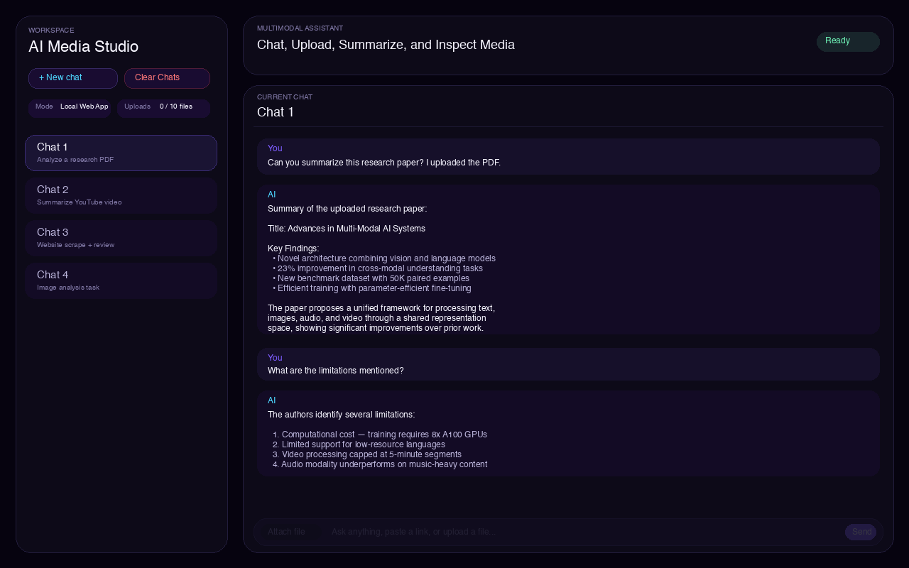
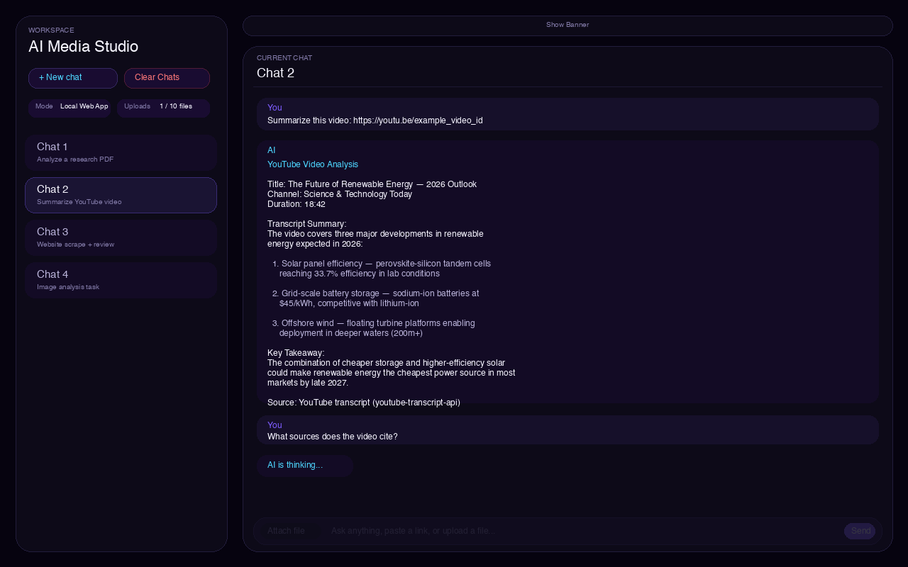
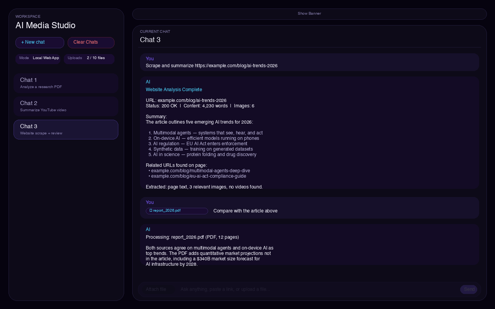
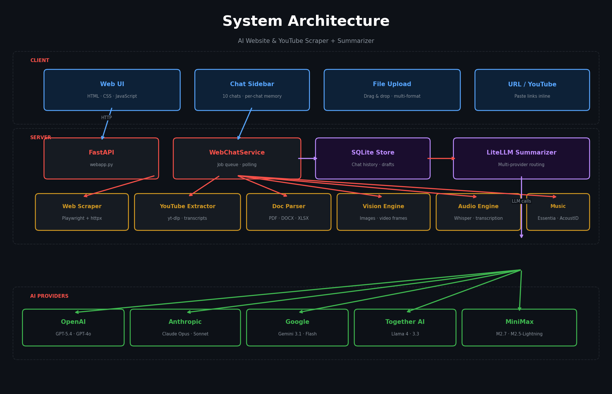
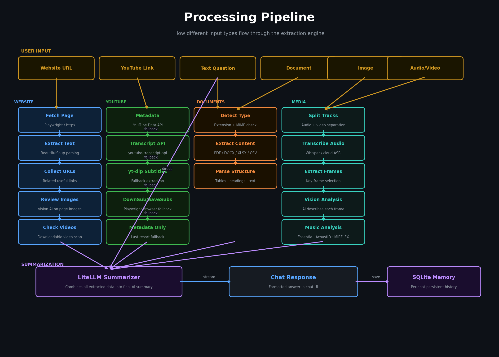

# AI Website Scraper + Summarizer V1.0 - LiteLLM

This project is centered around a local website interface: a dark multi-chat workspace where you can talk to the AI normally, upload files, paste links, and review results in a persistent chat history.

It supports multiple AI providers through [LiteLLM](https://docs.litellm.ai/), including OpenAI, Anthropic, Google Gemini, Together AI (Llama), and MiniMax.

People are very welcome to improve this project, remix it, fork it, stress-test it, and point out weak spots. If you find better libraries, cleaner architecture, safer workflows, stronger prompts, better UI ideas, or broken edge cases, I genuinely want that feedback.

## Screenshots

### Workspace — Multi-Chat Interface with Document Analysis



*The main workspace showing sidebar chat management, hero banner, chat area with an AI-summarized research paper, and the input bar with file attachment.*

### YouTube Video Analysis



*A YouTube link is pasted in chat and the AI extracts the transcript, summarizes key points, and answers follow-up questions.*

### Website Scraping + File Comparison



*A website is scraped and summarized, then a PDF is uploaded and compared against the article — showing multi-step analysis in a single chat.*

## Diagrams

### System Architecture



*Three-layer architecture: Web UI communicates with a FastAPI server that dispatches work to specialized extractors (web, YouTube, documents, vision, audio, music) and routes LLM calls through LiteLLM to five AI providers.*

### Processing Pipeline



*How different input types (URLs, YouTube links, documents, images, audio, video) flow through layered extraction with fallback chains, converging into a final LiteLLM summary stored in per-chat SQLite memory.*

## Supported AI Models

Set `TEXT_AI_MODEL` in your `.env` to any of these:

| Model | Provider |
|---|---|
| `gpt-5.4-pro` | OpenAI |
| `gpt-5.4-mini` | OpenAI |
| `gpt-4o` | OpenAI |
| `gpt-4o-mini` | OpenAI |
| `claude-opus-4-6` | Anthropic |
| `claude-sonnet-4-6` | Anthropic |
| `claude-haiku-4-5` | Anthropic |
| `claude-3.5-sonnet` | Anthropic |
| `gemini-3.1-pro` | Google |
| `gemini-3-flash` | Google |
| `gemini-2.5-flash-lite` | Google |
| `llama-4-maverick` | Together AI |
| `llama-4-scout` | Together AI |
| `llama-3.3-70b` | Together AI |
| `minimax-m2.7` | MiniMax |
| `minimax-m2.5-lightning` | MiniMax |

You can also pass any [LiteLLM-compatible model string](https://docs.litellm.ai/docs/providers) directly.

## What This Website Can Do

- normal AI chat with memory per chat
- multiple chats in a left sidebar
- rename, clear, delete, and clear-all chat controls
- upload files directly in the browser
- summarize websites
- summarize YouTube links
- analyze documents
- analyze images
- analyze audio files
- analyze video files

The website is designed to feel like a normal AI chat screen, but with the project's existing multimodal extraction pipeline behind it.

## Current Website Features

### Chat Workspace

- multi-chat sidebar
- chat limit of 10
- per-chat memory
- per-chat drafts and attachment state
- pause button while the AI is working
- local persistent history through SQLite
- banner hide/show toggle

### Supported Inputs

The website can work with:

- websites
- YouTube links
- text questions
- uploaded documents
- uploaded images
- uploaded audio
- uploaded video

Supported file types include:

- text and markup:
  - `.txt`, `.md`, `.csv`, `.json`, `.html`, `.xml`
- documents:
  - `.pdf`, `.docx`, `.pptx`, `.xlsx`, `.rtf`
- images:
  - `.png`, `.jpg`, `.jpeg`, `.avif`
- audio:
  - `.mp3`, `.wav`, `.m4a`, `.aac`, `.flac`, `.ogg`
- video:
  - `.mp4`, `.mov`

## Core Extraction Pipeline

The project tries to avoid dead-end failures by using layered extraction.

### Websites

- page text extraction
- related useful URL collection
- image review when relevant
- directly downloadable website-video review when possible
- final summary focused on the subject matter, not just page structure

### YouTube

The current YouTube flow is transcript-first:

1. optional `YouTube Data API` metadata
2. `youtube-transcript-api`
3. `yt-dlp` subtitle attempt
4. `DownSub + Playwright`
5. `SaveSubs + Playwright`
6. metadata fallback

That means the app can still give something useful even if direct YouTube access is partially blocked.

### Images and Video Frames

The active visual-description path uses your configured AI model.

That means:

- image descriptions come from your AI model
- video key-frame descriptions come from your AI model
- the older BLIP caption path is no longer the normal active description flow

### Audio and Video

The media pipeline can separate:

- transcript / speech analysis
- visual analysis
- music analysis

So a silent video can still be reviewed visually, and a music-heavy file can still produce music analysis even if speech transcription is weak.

### Music Analysis

The music layer is free/local-friendly by default:

- `Essentia`
  - local music features such as BPM, key, and loudness-like values
- `AcoustID`
  - optional song ID using local fingerprinting plus an API key
- `MIRFLEX`
  - optional repo hook for future music tagging/classification extensions

Important:

- `Essentia` is the default main music feature layer
- `AcoustID` is optional
- `MIRFLEX` is optional
- if one music stage fails, the others should still continue

## Honesty and Failure Handling

This project tries to stay honest about what actually happened.

It carries extra runtime and extraction context into the summary pipeline, including things like:

- which YouTube path actually succeeded
- which music libraries were attempted
- which music libraries produced output
- recent runtime diary lines
- which media was actually reviewed

That helps reduce fake claims like saying a fallback worked when it did not.

## Main Files

Most important files for the website version:

- website entrypoint:
  - `src/ai_scraper_bot/webapp.py`
- web backend:
  - `src/ai_scraper_bot/web/service.py`
  - `src/ai_scraper_bot/web/store.py`
- web frontend:
  - `src/ai_scraper_bot/web/static/index.html`
  - `src/ai_scraper_bot/web/static/app.css`
  - `src/ai_scraper_bot/web/static/app.js`
- shared config:
  - `src/ai_scraper_bot/config.py`
- shared prompts:
  - `src/ai_scraper_bot/prompts.py`
- summarizer / LiteLLM integration:
  - `src/ai_scraper_bot/services/summarizer.py`
- YouTube extraction:
  - `src/ai_scraper_bot/services/youtube.py`
- website extraction:
  - `src/ai_scraper_bot/services/website.py`
- transcript-site fallbacks:
  - `src/ai_scraper_bot/services/downsub.py`
  - `src/ai_scraper_bot/services/savesubs.py`
- transcription:
  - `src/ai_scraper_bot/services/transcription.py`
- local video analysis:
  - `src/ai_scraper_bot/services/video_analysis.py`
- local vision:
  - `src/ai_scraper_bot/services/vision.py`
- local music analysis:
  - `src/ai_scraper_bot/services/music_analysis.py`
- file parsing:
  - `src/ai_scraper_bot/parsers/file_parser.py`

## Quick Start

The full setup guide is in [docs/SETUP.md](docs/SETUP.md).

At a high level:

1. install Python 3.11
2. install system tools like `ffmpeg` and `tesseract`
3. create and activate `.venv`
4. install `requirements.txt`
5. install Playwright Chromium
6. create `.env` from `.env.example`
7. fill in `TEXT_AI_MODEL` and `TEXT_AI_API_KEY` with your chosen AI provider
8. optionally add audio transcription, YouTube Data API, AcoustID, and MIRFLEX settings
9. run the website

## Start the Website

```bash
cd "/path/to/project"
source .venv/bin/activate
PYTHONPATH=src python -m ai_scraper_bot.webapp
```

Then open:

```text
http://127.0.0.1:8000
```

Useful website env vars:

- `WEBAPP_HOST`
- `WEBAPP_PORT`
- `WEBAPP_DB_PATH`

Default local values are:

- host: `127.0.0.1`
- port: `8000`
- database: `./.webapp/webapp.sqlite`

## Recommended Defaults

If you want a solid default setup:

- `ENABLE_LOCAL_VISION=true`
- `ENABLE_MUSIC_DETECTION=true`
- `MUSIC_ESSENTIA_ENABLED=true`
- `MUSIC_ACOUSTID_ENABLED=false` until AcoustID is configured
- `MUSIC_MIRFLEX_ENABLED=false` until MIRFLEX is actually set up
- `YOUTUBE_COOKIE_MODE_ENABLED=false`
- `YOUTUBE_DOWNSUB_ENABLED=true`
- `YOUTUBE_SAVESUBS_ENABLED=true`
- `YOUTUBE_TRANSCRIPT_SITE_HEADLESS=true`

## Privacy and Sharing Notes

Before sharing or publishing, do **not** expose:

- `.env`
- `.venv`
- downloaded test media
- cookies files
- browser profile exports
- real API keys
- local machine-specific secrets

The repo is meant to keep those out through `.gitignore`, but you should still double-check before uploading.

## Troubleshooting Notes

### YouTube still fails

That does not always mean the whole app is broken. Check which stage actually failed:

- `youtube-transcript-api`
- `yt-dlp`
- `DownSub`
- `SaveSubs`
- metadata fallback

### Audio transcription fails with NumPy / torch issues

The local Whisper setup is currently intended to run with `numpy<2`.

### A video has no audio

Some `.mp4` or `.mov` files are silent. In that case:

- transcript-based audio analysis will not run
- visual review can still run
- music analysis can only run if an audio stream actually exists

### MIRFLEX is enabled but not working

The current code treats MIRFLEX as an optional repo hook. The rest of the music chain should still continue even if MIRFLEX itself is not fully wired.

## Full Setup

For the exact detailed installation and configuration flow, read [docs/SETUP.md](docs/SETUP.md).

For a complete reference of every environment variable, see [ENVREADME.md](ENVREADME.md).
