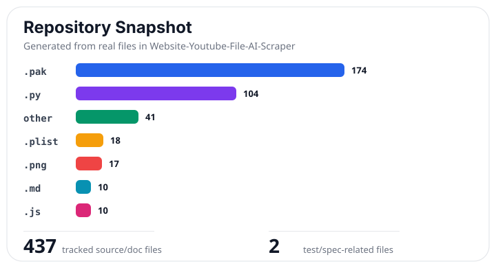
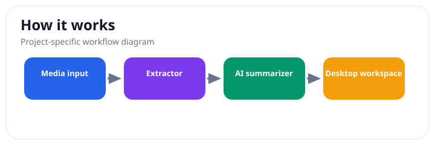

# AI Media Studio — Desktop App (v1.0.0)

> One workspace that summarizes and compares **websites, YouTube videos, documents, images, audio, and video** — powered by a local Python extraction pipeline and LiteLLM model routing.


> Status: beta desktop/web AI workspace. The repo name still reflects the original scraper/Discord-bot roots, but the current product is **AI Media Studio**.

---

## ⚡ TL;DR — what you need to know

| | |
| --- | --- |
| **What it is** | A multimodal AI chat workspace: paste a URL, YouTube link, or drop a file, and get an AI summary/analysis — with per-chat memory. |
| **Install** | Download a [release](https://github.com/Evan1108-Coder/Website-Youtube-File-AI-Scraper/releases) installer, **or** run from source (see [Quick Start](#-quick-start)). |
| **Inputs** | Websites · YouTube · text · PDF/DOCX/PPTX/XLSX/RTF/MD/CSV/JSON/HTML/XML · images · audio · video. |
| **Requires** | Python **3.10+**, an AI provider key in `.env`; for full features: `ffmpeg`, `tesseract`, Playwright Chromium. |
| **Models** | 22+ models across 5 providers (OpenAI, Anthropic, Google, Together/Llama, MiniMax) — or any LiteLLM string. Set `TEXT_AI_MODEL`. |
| **Why it's robust** | Layered extraction with **fallback chains** (esp. YouTube transcripts) so a summary still works when one path is blocked. |
| **Drag & drop** | Drop files straight onto the desktop window to analyze them. |
| **Local-first** | DB, downloads, transcripts, and uploads stay in user-writable local locations. You pay your own provider API usage. |
| **Honesty layer** | The app carries *which path actually succeeded* into the summary, to avoid faking that a fallback worked. |

**Who it's for:** anyone who wants a single tool to read/watch/listen *for* them — researchers comparing a paper against an article, people summarizing long videos, or anyone tired of juggling separate scraper / transcript / OCR / vision tools.

**Jump to:** [Screenshots](#screenshots) · [Quick Start](#-quick-start) · [Architecture](#diagrams) · [What it can do](#what-this-app-can-do) · [Supported inputs & file types](#supported-inputs--file-types) · [Extraction pipeline](#core-extraction-pipeline) · [Models](#supported-ai-models) · [Desktop install](#installation-desktop-app) · [Run from source](#development-run-from-source) · [Build installers](#building-installers) · [Config defaults](#recommended-defaults) · [Troubleshooting](#troubleshooting-notes)

---

## Why use AI Media Studio?

- Handles **many input types in one workspace** instead of separate tools.
- Uses **extraction fallbacks** so summaries can still work when one source path fails.
- Keeps **per-chat memory** and uploaded context local to the app workflow.
- Supports **multiple AI providers** through [LiteLLM](https://docs.litellm.ai/).

### Current limitations

- Summaries are only as reliable as the extracted source content and the selected model.
- Some websites, videos, or files may block extraction or require fallback analysis.
- API keys and local dependencies are required for full multimodal functionality.

---

## Screenshots

### Workspace — Multi-Chat Interface with Document Analysis

*Sidebar chat management, hero banner, chat area with an AI-summarized research paper, and the input bar with file attachment.*

### YouTube Video Analysis

*A YouTube link is pasted in chat; the AI extracts the transcript, summarizes key points, and answers follow-ups.*

### Website Scraping + File Comparison

*A website is scraped and summarized, then a PDF is uploaded and compared against the article — multi-step analysis in one chat.*

---

## 🚀 Quick Start

### Option A — Desktop installer (recommended)

Get the latest from the [Releases page](https://github.com/Evan1108-Coder/Website-Youtube-File-AI-Scraper/releases):

| Platform | File |
|----------|------|
| macOS (Apple Silicon — M1/M2/M3/M4) | `AI-Media-Studio-1.0.0-macOS-Apple-Silicon.dmg` |
| macOS (Intel) | `AI-Media-Studio-1.0.0-macOS-Intel.dmg` |
| Windows (64-bit) | `AI-Media-Studio-Setup-1.0.0-Windows-x64.exe` |

See [Installation (Desktop App)](#installation-desktop-app) for prerequisites and first-launch steps.

### Option B — Run from source

```bash
git clone https://github.com/Evan1108-Coder/Website-Youtube-File-AI-Scraper.git
cd Website-Youtube-File-AI-Scraper
python -m venv .venv
source .venv/bin/activate
pip install -r requirements.txt
cp .env.example .env
# Edit .env with the AI provider keys you want to use
uvicorn src.ai_scraper_bot.webapp:app --reload
```

The web server runs at `http://127.0.0.1:8000` (or port 18919 when launched via Electron).

---

## Desktop App Features

Everything from the web version, plus:

- **Native app** — launches from Applications/Start Menu, with its own dock icon.
- **Drag-and-drop** — drop files directly onto the window to analyze them.
- **Auto-starts backend** — no need to manually run a Python server.
- **Hidden inset titlebar** (macOS) — clean, modern appearance.
- **Persistent storage** — database and downloads in user-writable locations.

---

## What this app can do

- Normal AI chat with **memory per chat**.
- **Multiple chats** in a left sidebar (limit 10), with rename / clear / delete / clear-all controls.
- Upload files directly in the browser or by drag-and-drop.
- Summarize **websites** and **YouTube links**.
- Analyze **documents, images, audio, and video**.
- Per-chat drafts & attachment state, a **pause button** while the AI works, local SQLite history, and a banner hide/show toggle.

It's designed to feel like a normal AI chat screen, with the project's multimodal extraction pipeline behind it.

---

## Supported inputs & file types

**Inputs:** websites · YouTube links · text questions · uploaded documents / images / audio / video.

| Category | Extensions |
| --- | --- |
| Text & markup | `.txt` `.md` `.csv` `.json` `.html` `.xml` |
| Documents | `.pdf` `.docx` `.pptx` `.xlsx` `.rtf` |
| Images | `.png` `.jpg` `.jpeg` `.avif` |
| Audio | `.mp3` `.wav` `.m4a` `.aac` `.flac` `.ogg` |
| Video | `.mp4` `.mov` |

---

## Core extraction pipeline

The project avoids dead-end failures by using **layered extraction**.

### Websites
Page-text extraction → related useful-URL collection → image review when relevant → directly-downloadable website-video review when possible → a final summary focused on the subject matter, not just page structure.

### YouTube (transcript-first, with fallbacks)
1. optional `YouTube Data API` metadata
2. `youtube-transcript-api`
3. `yt-dlp` subtitle attempt
4. `DownSub + Playwright`
5. `SaveSubs + Playwright`
6. metadata fallback

So the app can still produce something useful even if direct YouTube access is partially blocked.

### Images & video frames
The active visual-description path uses your configured AI model — image descriptions and video key-frame descriptions both come from your model (the older BLIP caption path is no longer the normal active flow).

### Audio & video
The media pipeline separates **transcript/speech analysis**, **visual analysis**, and **music analysis** — so a silent video can still be reviewed visually, and a music-heavy file can still produce music analysis even if speech transcription is weak.

### Music analysis (free/local-friendly by default)
- **`Essentia`** — default music feature layer (BPM, key, loudness-like values).
- **`AcoustID`** — optional song ID via local fingerprinting + API key.
- **`MIRFLEX`** — optional repo hook for future music tagging/classification.

If one music stage fails, the others continue.

### Honesty & failure handling
The app carries extra runtime/extraction context into the summary pipeline — which YouTube path succeeded, which music libraries were attempted vs produced output, recent runtime diary lines, and which media was actually reviewed — to reduce fake claims like "a fallback worked" when it didn't.

---

## Supported AI Models

Set `TEXT_AI_MODEL` in your `.env` to any of these (or any [LiteLLM-compatible model string](https://docs.litellm.ai/docs/providers)):

| Provider | Models |
|---|---|
| OpenAI | `gpt-5.5-pro`, `gpt-5.5`, `gpt-5.5-mini`, `gpt-5.4-pro`, `gpt-5.4-mini`, `gpt-4o`, `gpt-4o-mini` |
| Anthropic | `claude-opus-4-7`, `claude-sonnet-4-7`, `claude-opus-4-6`, `claude-sonnet-4-6`, `claude-haiku-4-5`, `claude-3.5-sonnet` |
| Google | `gemini-3.1-pro`, `gemini-3-flash`, `gemini-2.5-flash-lite` |
| Together AI (Llama) | `llama-4-maverick`, `llama-4-scout`, `llama-3.3-70b` |
| MiniMax | `minimax-m3`, `minimax-m2.7`, `minimax-m2.5` |

---

## Installation (Desktop App)

### macOS
1. Download the `.dmg` for your chip (Apple Silicon or Intel).
2. Open the DMG and drag **AI Media Studio** to Applications.
3. On first launch, right-click the app → **Open** (to bypass Gatekeeper — the app is unsigned).
4. The app auto-starts the Python backend.

### Windows
1. Download the `.exe` installer.
2. Run it and follow the prompts.
3. Launch **AI Media Studio** from the Start Menu.

### Prerequisites
- **Python 3.10+** in PATH, with `pip install -r requirements.txt`.
- System tools: **`ffmpeg`**, **`tesseract`** (audio/OCR features).
- Playwright Chromium: `playwright install chromium` (website scraping).
- `.env` with your AI API keys (see `.env.example`).

### Where the app stores data
- Database: `~/Library/Application Support/ai-media-studio/webapp.sqlite` (macOS) / `%APPDATA%/ai-media-studio/webapp.sqlite` (Windows).
- Downloads: `~/Documents/AI Media Studio Downloads/`.

---

## Development (Run from Source)

Full guide in [SETUP.md](SETUP.md).

```bash
pip install -r requirements.txt
npm install

npm start                                   # Electron app in dev mode
# or run just the web server:
PYTHONPATH=src python -m ai_scraper_bot.webapp
```

### Main files

| Area | Files |
| --- | --- |
| Web entrypoint | `src/ai_scraper_bot/webapp.py` |
| Web backend | `src/ai_scraper_bot/web/service.py`, `web/store.py` |
| Web frontend | `src/ai_scraper_bot/web/static/index.html`, `app.css`, `app.js` |
| Shared config / prompts | `src/ai_scraper_bot/config.py`, `prompts.py` |
| Summarizer (LiteLLM) | `src/ai_scraper_bot/services/summarizer.py` |
| YouTube extraction | `src/ai_scraper_bot/services/youtube.py` |
| Website extraction | `src/ai_scraper_bot/services/website.py` |
| Transcript-site fallbacks | `services/downsub.py`, `services/savesubs.py` |
| Transcription | `src/ai_scraper_bot/services/transcription.py` |
| Local video / vision / music | `services/video_analysis.py`, `services/vision.py`, `services/music_analysis.py` |
| File parsing | `src/ai_scraper_bot/parsers/file_parser.py` |

---

## Building Installers

```bash
npm run build:mac    # macOS (arm64 + x64)
npm run build:win    # Windows (x64)
npm run build:all    # both platforms
```

Output goes to `dist-electron/`.

---

## Recommended Defaults

```env
ENABLE_LOCAL_VISION=true
ENABLE_MUSIC_DETECTION=true
MUSIC_ESSENTIA_ENABLED=true
MUSIC_ACOUSTID_ENABLED=false      # until AcoustID is configured
MUSIC_MIRFLEX_ENABLED=false       # until MIRFLEX is actually set up
YOUTUBE_COOKIE_MODE_ENABLED=false
YOUTUBE_DOWNSUB_ENABLED=true
YOUTUBE_SAVESUBS_ENABLED=true
YOUTUBE_TRANSCRIPT_SITE_HEADLESS=true
```

Full env reference: [ENVREADME.md](ENVREADME.md).

---

## Diagrams

### System Architecture

*Web UI ↔ FastAPI server ↔ specialized extractors (web, YouTube, documents, vision, audio, music), with LLM calls routed through LiteLLM to multiple providers.*

### Processing Pipeline

*How URLs, YouTube links, documents, images, audio, and video flow through layered extraction with fallback chains, converging into a final LiteLLM summary stored in per-chat SQLite memory.*

---

## Privacy & data handling

- API keys belong in `.env` and should **never** be committed.
- Uploaded files, scraped content, transcripts, and summaries may be stored locally by the app.
- Content can be sent to the configured AI provider when you ask the app to summarize/analyze it.
- Don't upload private/sensitive files unless you understand your local setup and selected provider.
- Before sharing the repo, do **not** expose `.env`, `.venv`, downloaded test media, cookies files, browser profile exports, real API keys, or machine-specific secrets (`.gitignore` covers these — double-check anyway).
- See [SECURITY.md](SECURITY.md) for vulnerability reporting and secret handling.

---

## Troubleshooting Notes

**YouTube still fails** — that doesn't mean the whole app is broken; check which stage failed (`youtube-transcript-api`, `yt-dlp`, `DownSub`, `SaveSubs`, metadata fallback).

**Audio transcription fails with NumPy / torch issues** — the local Whisper setup is currently intended to run with `numpy<2`.

**A video has no audio** — some `.mp4`/`.mov` files are silent: transcript audio analysis won't run, but visual review still can; music analysis only runs if an audio stream exists.

**MIRFLEX enabled but not working** — it's an optional repo hook; the rest of the music chain continues regardless.

More: [TROUBLESHOOTING.md](TROUBLESHOOTING.md).

---

## Reference docs

| Topic | Document |
| --- | --- |
| Full setup & configuration | [SETUP.md](SETUP.md) |
| Every environment variable | [ENVREADME.md](ENVREADME.md) |
| Troubleshooting | [TROUBLESHOOTING.md](TROUBLESHOOTING.md) |
| Security policy | [SECURITY.md](SECURITY.md) |
| Contributing | [CONTRIBUTING.md](CONTRIBUTING.md) |

---

## License

MIT License — © Evan Lu. See [LICENSE](LICENSE).

---

## Real visual snapshot

These visuals are generated from the actual repository structure and project workflow, not placeholders.




